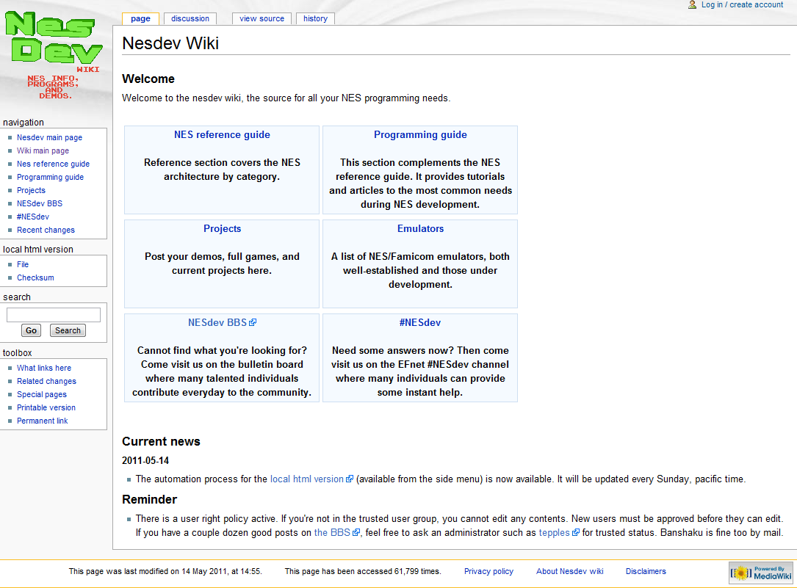
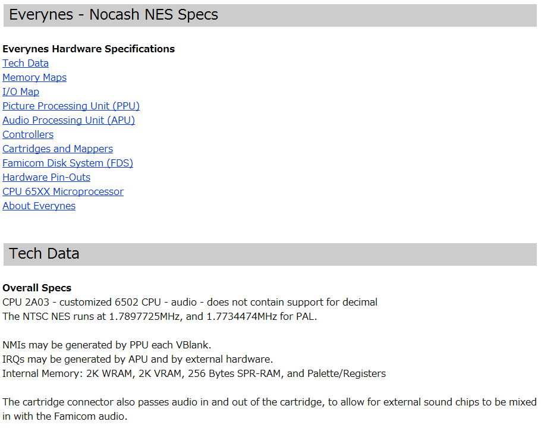
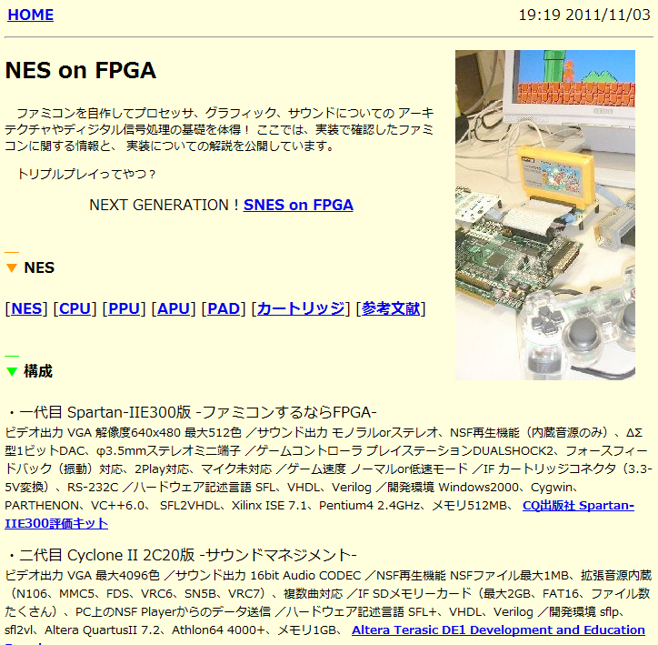
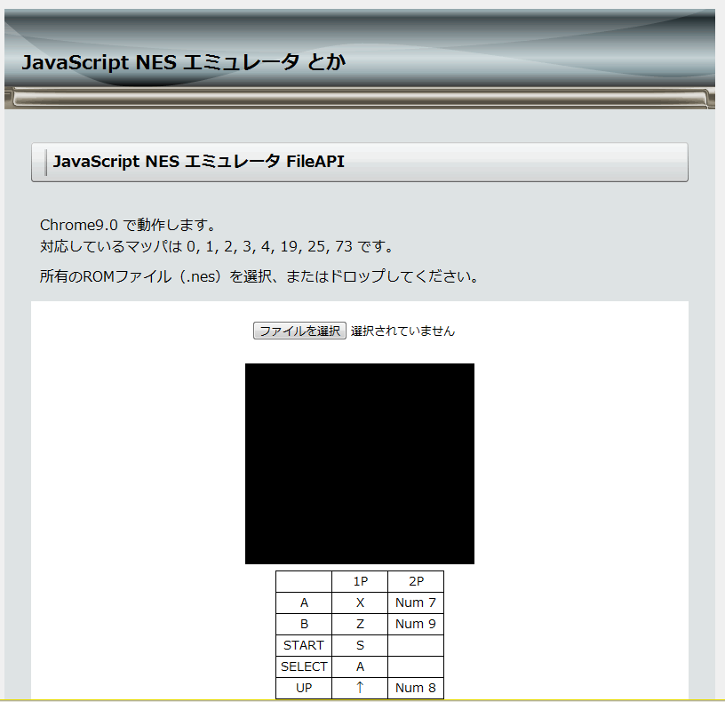

# 資料を集めよう。

というわけで、ぼんやりとは何を作ればいいのかが分かりましたから、具体的に、ファミコンはそれぞれのパーツがどのようになっているのかを調べましょう。

本来は、こういうのは半田ごてとロジックアナライザ、オシロスコープなどを駆使して解析して調べるところですが、今の私のスキルでは、まだこの”魔法”は使えそうにありません。これは将来の目標にして、今回この部分は他人の情報を頼りにして作っていくことにしました。
幸いにも、作るターゲットを「ファミコン」としたおかげで、これには困らないくらいにたくさんの資料がインターネット上に存在します。他のゲーム機では、解析無しに作るのはおそらく無理だろうと思います。

一番安直なのが、Wikipedia。さすがにどうかと思われるかもしれませんが、実は”おおまか”に調べる程度であればいろいろと載っています。また、「PPU」とか、チップの型番みたいな難しい単語（？）が色々載っているので、Googleで調べる際に使う単語のリストとして使えます。

先ほどの６つのパーツに関しては、次のような答えが得られました。

- CPU:カスタムされたMOS 6502
- メモリ：2KB(たったの2048バイト！）
- 外部記憶：カートリッジ
- ビデオ：リコー製PPU
- サウンド：APUと呼ばれる矩形波やパルス波といった波を直接出力する独自音源、CPU内蔵

それぞれについて実際に実装するときには、このキーワードたちで検索していけばよいでしょう。
ファミコンは非常に人気なゲーム機ですから、ファミコンを対象にした解析資料サイトも存在しています。それらの中から、とっても参考になったものをいくつかご紹介しましょう。開発している間は、ずっと開いていたと言っても過言ではないくらい便利なサイトたちです。

## NESDEV Wiki

URL: http://wiki.nesdev.com/w/index.php/Nesdev_Wiki

NESのエミュレータ・自作ソフト開発者にとってのバイブルと言ってもいいです。CPU、ビデオ、サウンド、カートリッジの他、電極の配置のような、ハードウェアの仕様まで書いてあります。エミュレータの開発時に躓きやすいポイントや、エミュレータのテスト用プログラムが置いてあるなど、至れり尽くせりです。

なお、このWikiは派生元で、元のNESDEV（URL：[http://nesdev.parodius.com/](http://nesdev.parodius.com/)）にあった情報を、有志がまとめて加筆訂正したものであるみたいです。元のNESDEVは玉石混淆すぎるため、あまり参照しなかったのですが、CPUの命令別の詳しい動作情報が載っているテキストはこちらにしか無いなど、元の方にも参考になる情報もありました。
本当に細かい仕様が分からずに悩んだ場合は、フォーラムで検索してみると、答えが得られる事もあるかもしれません。（URL: [http://nesdev.parodius.com/bbs/](http://nesdev.parodius.com/bbs/)）

## Everynes

URL:http://nocash.emubase.de/everynes.htm

エミュレータマニアには有名なno$シリーズの作者による解析情報です。NDS/ゲームボーイアドバンスや、MSXのエミュレータも手がけていて、それらの解析情報も公開されています。
概ね内容はNESDEVと被るのですが、たまにNESDEVと言っていることが食い違って、こちらの方が正しいと思われる場合があります（逆もあります）。また、同じであったとしても表現にNESDEVとずいぶん違う所があるため、NESDEVに書いてあることがいまいちわからない、あるいはうまく実装できない…と思ったら、こちらに来ると良いと思います。1ページに全部纏めてるせいでちょっと見づらいのが難点。

## NES on FPGA

URL: http://crystal.freespace.jp/pgate1/nes/

3サイト目は日本語のサイト！こちらはファミコンをコンピュータでのエミュレーションでなく、FPGAという、「”回路をプログラミング”できるチップ」を使って再現された方による、資料＆開発日誌です。単なる資料としてでなく、開発日誌が読み物としても、とっても楽しいです♪

前２つに比べるとあまり詳しくはないのですが、サウンドのところは、前２つに比べて動作が自然言語で詳しく説明されており、日本語であることも相まって非常にわかりやすいです。前２つを読む前に、とりあえずこのサイトを読んでおくのがおすすめです。
読み物として楽しい開発日誌の方も、同じポイントで躓いた場合に助けになるかもしれません。

## JavaScript NES Emulator

URL:http://twoseater.my-sv.net/nesfileapi/

他人のエミュレータのソースコードを参考にするのは、ちょーっと、気が引けます？だいじょうぶ、すぐにそんなこと言ってられなくなります（笑）。自然言語だけで書かれたテキストではやっぱり細かい所がわからなかったり、サイトどうしで意見が食い違っていたり、そもそも詳しく書かれていなかったりする場合、実際にゲームが動くエミュレータは、とても頼りになる情報源です。

でも、エミュレータ同士でもある機能に関する動作が違う（けど、ソフトは動く）事があったりして、ホント訳がわからなくなってしまうのですが、ここは一つ「厳密に再現しなくても、エミュレータは動く」と好意的に解釈して行きましょう（笑。

このJavaScriptのエミュレータは、速度を第一に書かれた他のCやJavaで書かれたエミュレータに比べて、とてもソースコードの見通しがよく、非常に読みやすいです。また、ブラウザに付属のデバッガを用いることで、かなり容易に動作を追いかけることができます。
ただし、速度を稼ぐためなのか、ビデオ処理で随分再現性を損ねている部分があるので、ご注意を。

## 英語必須。
さて、そろそろお気づきかと思いますが、さすがに日本語のサイトだけでは情報が足りません。とはいえ、JavadocとMSDNを原文で何とか読めて、JavaやC#のAPIが使える程度の英語力があればなんとかなります。なお、英語で検索するときは、「ファミコン」や「Famicom」ではなく、海外での名称「NES（Nintendo Entertainment System）」で検索しないとヒットしませんよ～！

また、ネット上の有象無象のゲームマニアのサイトにも、様々な詳しさや視点から書かれたテキストがたくさんあります。例えば、ファミコンで作曲をしたい人向けに書かれたウェブサイトには、前述の解説サイトたちのようなハードウェアを再現する視点からではなく、プログラマ向けのソフトウェアの立場からの説明でもなく、あくまで音源として使いたい人たちの視点から書かれた説明があります。

もちろん、もっと一般の人向けに書かれた、簡単で概念的にさらっと書いてあるようなテキストも、なんと言ったってファミコンですから、た～くさん存在します。

エミュレータは、対象のすべてのパーツを一から再現しなくてはならないため、非常に広い範囲の知識が要求されます。もしもあなたのあまり知らない分野などで、詳しい資料を直接見ても理解できなかった場合（私は、サウンドがいまいちわかりませんでした）、こういった一般向けのサイトや、別の視点からのウェブサイトを見ることで、理解の助けになることがあります。

## それ以外に「プログラム」を実装するのに必要なこと。

今までエミュレーション対象であるファミコンの側からずっと見てきましたが、エミュレータもただのプログラムです。普通のプログラムと同じように、プログラミング言語を使って開発して、普通のプログラムと同じようにビルドして、普通のプログラムと同じように起動します。そこは同じです。

では、エミュレータに適した言語や、適した開発環境は何でしょう？

…***実はそんなもの無い***ので、お好きなもの、あるいは一番慣れててるものを使ってください。C++でもPythonでもJavaでも良いですし、前述の資料に使うとしたエミュレータは、JavaScript製でした。以下の条件を一応挙げておきますが、有名な言語なら殆どの言語で満たす条件です。

 - 「手続き型」言語として書ける（関数型などでない）
 - 画像や音声がある程度高速（秒間60回）に出力できる
 - ユーザのキーボードやコントローラからの入力を受け取ることができる

今回私はC++を使いました。この言語では、SDL1というゲーム開発で有名なライブラリを使うことで、音声や画像の出力、ジョイパッドからのユーザ入力を簡単に行うことができます。

CでなくC++にしたのは、CPUやビデオといったそれぞれのパーツを”クラス”とし、クラスの隠蔽機能を使うことで、パーツごとの独立性を高めて見通しをよく出来ると考えたからです。また、カセットはたくさん種類があり（例えば、同じマリオでもマリオ１とマリオ３はカセットの種類―マッパーといいます―が違います）、それらをうまく表現するにはクラスの「継承」が使えると考えたからです。

ついでに言うと、C++で書かれた既存のエミュレータたちと速度の比較をしたかったので…（笑。

しかし、C++特有のテンプレートのような機能はエミュレータ本体では使っていませんし、C++の標準ライブラリなども殆ど使っていません。

この本はプログラミング入門の本ではないため、あなたがC++を普通に読めることを前提としてソースコードの解説を行なっていきますが、ご了承ください。でも多分JavaかC#が読めるなら、この本の中でのC++も普通に読めると思います。